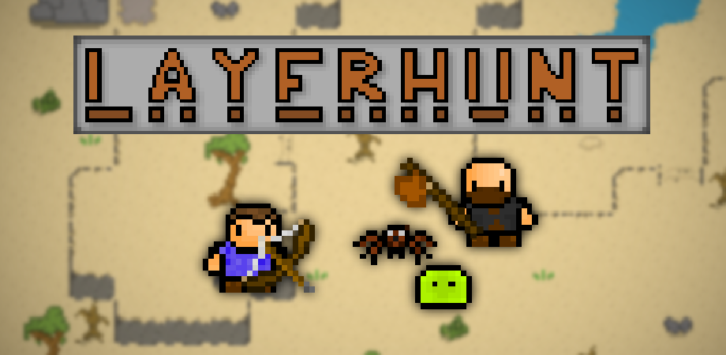
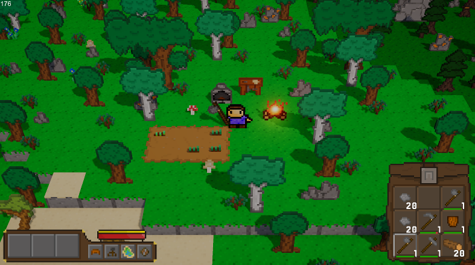
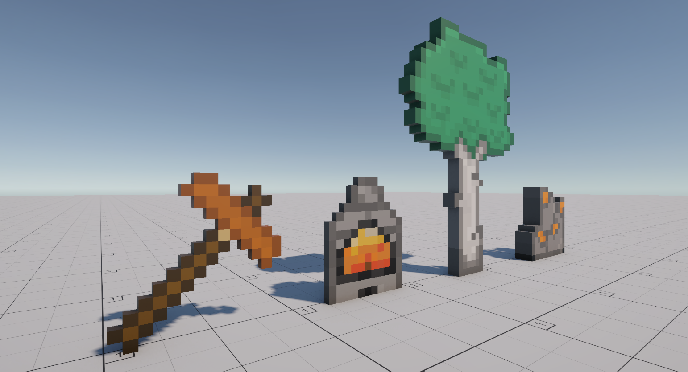

# My Projects

This is a normal paragraph following a header. GitHub is a code hosting platform for version control and collaboration. It lets you and others work together on projects from anywhere.

## Layer Hunt 1



Steam store page: <https://store.steampowered.com/app/2084230/Layer_Hunt/>

Layer Hunt is a survival sandbox and dungeon game where the goal is to survive and hunt down all the bosses. To reach your goal you will have to mine, craft, build, farm, fight and explore for new abilities and resources. The world is broken up through many different layers that each offer new enemies, minerals and dungeons to explore. To progress, the player must explore all these layers and eliminate each layer's boss to finally beat the game.

<div style="
    display:grid;
    grid-template-columns:repeat(2, 1fr);
    gap:12px;
    margin:10px 0;
">
    
    
    
    
</div>

## Layer Hunt 2

This is a normal paragraph following a header. GitHub is a code hosting platform for version control and collaboration. It lets you and others work together on projects from anywhere.

## Cogwheel Game Engine
This is a normal paragraph following a header. GitHub is a code hosting platform for version control and collaboration. It lets you and others work together on projects from anywhere.

## Unity Sprite Extruder Asset


This is a normal paragraph following a header. GitHub is a code hosting platform for version control and collaboration. It lets you and others work together on projects from anywhere.

<!--

Text can be **bold**, _italic_, or ~~strikethrough~~.

[Link to another page](./another-page.html).

There should be whitespace between paragraphs.

There should be whitespace between paragraphs. We recommend including a README, or a file with information about your project.


```js
// Javascript code with syntax highlighting.
var fun = function lang(l) {
  dateformat.i18n = require('./lang/' + l)
  return true;
}
```

```ruby
# Ruby code with syntax highlighting
GitHubPages::Dependencies.gems.each do |gem, version|
  s.add_dependency(gem, "= #{version}")
end
```

#### Header 4

*   This is an unordered list following a header.
*   This is an unordered list following a header.
*   This is an unordered list following a header.

##### Header 5

1.  This is an ordered list following a header.
2.  This is an ordered list following a header.
3.  This is an ordered list following a header.

###### Header 6

| head1        | head two          | three |
|:-------------|:------------------|:------|
| ok           | good swedish fish | nice  |
| out of stock | good and plenty   | nice  |
| ok           | good `oreos`      | hmm   |
| ok           | good `zoute` drop | yumm  |

### There's a horizontal rule below this.

* * *

### Here is an unordered list:

*   Item foo
*   Item bar
*   Item baz
*   Item zip

### And an ordered list:

1.  Item one
1.  Item two
1.  Item three
1.  Item four

### And a nested list:

- level 1 item
  - level 2 item
  - level 2 item
    - level 3 item
    - level 3 item
- level 1 item
  - level 2 item
  - level 2 item
  - level 2 item
- level 1 item
  - level 2 item
  - level 2 item
- level 1 item

### Small image


### Large image


### Definition lists can be used with HTML syntax.

<dl>
<dt>Name</dt>
<dd>Godzilla</dd>
<dt>Born</dt>
<dd>1952</dd>
<dt>Birthplace</dt>
<dd>Japan</dd>
<dt>Color</dt>
<dd>Green</dd>
</dl>

```
Long, single-line code blocks should not wrap. They should horizontally scroll if they are too long. This line should be long enough to demonstrate this.
```

```
The final element.
```

-->