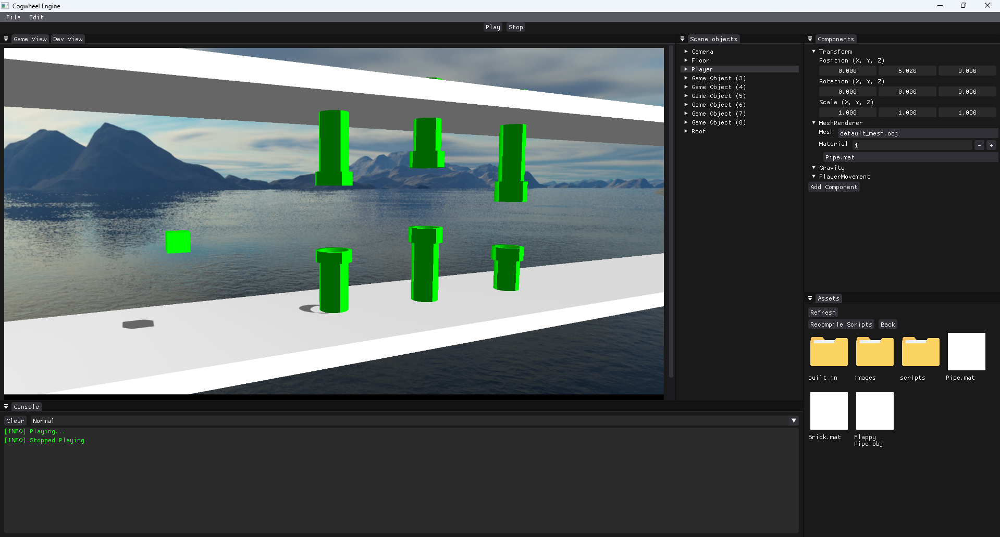
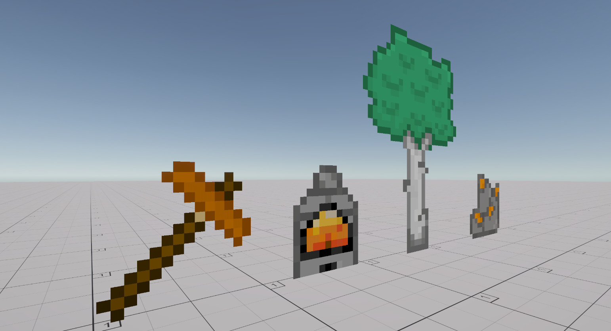

# My Projects

Here are some of the projects I have done or are currently working on. For more projects check out [my GitHub](https://github.com/EdvinAndersson).

## Layer Hunt 1

[Layer Hunt on Steam](https://store.steampowered.com/app/2084230/Layer_Hunt/)

Layer Hunt is a survival sandbox and dungeon game where the goal is to survive and hunt down all the bosses. To reach your goal you will have to mine, craft, build, farm, fight and explore for new abilities and resources. The world is broken up through many different layers that each offer new enemies, minerals and dungeons to explore. To progress, the player must explore all these layers and eliminate each layer's boss to finally beat the game.

    
    
    
    

## Layer Hunt 2

This is the sequel of Layer Hunt. Instead of a 2D world like its predecessor, the world is now 3D. The meshes are generated from the same sprites but are extruded by 1 pixel, giving a unique 2.5D art-style. This is currently under development and will be released on Steam.

## Cogwheel Game Engine

A 3D game engine created as Bachelor thesis project. The engine has an Editor like Unity/Unreal and is capable of creating small simple games, including meshes, materials, and custom scripts. The engine is written in C++, but most of the codebase is written in C-styled data-oriented way, with a large focus on performance and memory.

[Cogwheel on Github](https://github.com/EdvinAndersson/Cogwheel)

## Unity Sprite Extruder Asset

Sprite Extruder is a Unity Store Asset which converts Sprite assets into extruded 3D meshes while preserving the shape of the visible sprite. It handles transparent pixels and is able to extrude sprites to different depths. Uses greedy meshing to reduce unnecessary geometry and generate optimized meshes with fewer faces and vertices.

